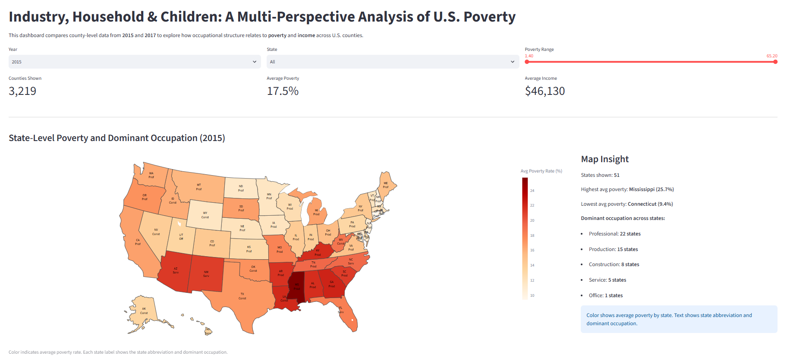

# Industry, Household & Children: A Multi-Perspective Analysis of U.S. Poverty
## Live Demo
🌐 Streamlit Dashboard: https://poverty-dashboard-shi-yang.streamlit.app/

## Overview
This project explores the relationship between occupational structure and poverty across U.S. counties using the American Community Survey (ACS) datasets from 2015 and 2017.

The objective was to investigate how employment composition influences regional poverty levels and to build an interactive dashboard that enables users to explore geographic and socioeconomic patterns through visual analytics.

This project was completed as a two-person team project.

## Dashboard Features

- Interactive poverty map
- County-level poverty exploration
- Occupation vs. poverty visualization
- Child poverty analysis
- Dynamic filtering
- Comparative visual analytics

## Future Improvements

- Deploy additional datasets
- Support more ACS years
- Add predictive analytics
- Improve dashboard responsiveness

## My Contributions

- Developed the interactive Streamlit dashboard
- Designed the dashboard layout and user interface
- Implemented interactive filters and visualizations
- Co-authored the project report

## Teammate Contributions

- Data cleaning and preprocessing
- Dataset preparation and integration
- Co-authored the project report

## Tech Stack

- Python
- Streamlit
- Pandas
- Plotly
- GeoPandas
- NumPy
